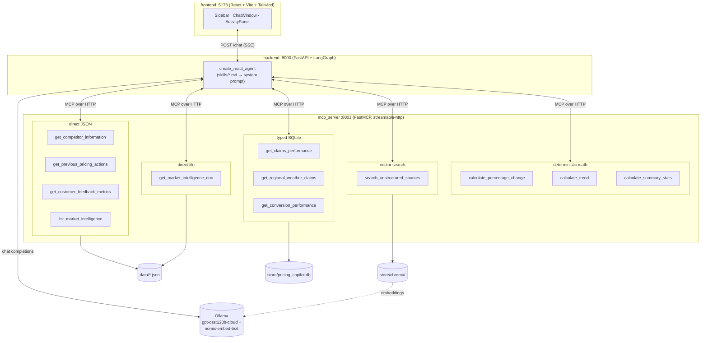
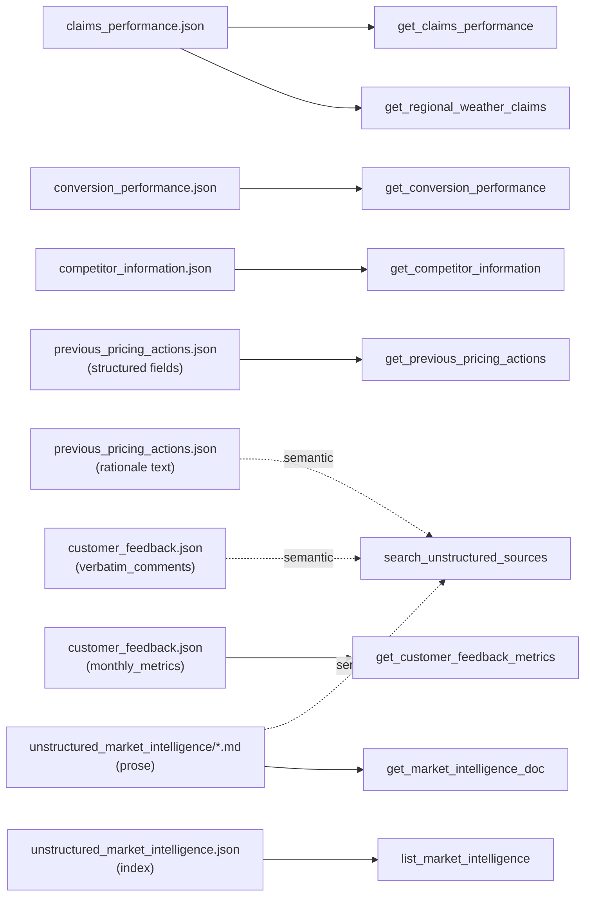

# Implementation Notes — Pricing Analyst Copilot

Phase 1 build for Challenge B (`challenge.md`): an AI agent that acts as a
Pricing Analyst Copilot over 6 synthetic Aviva UK motor insurance data
sources. This doc covers the high-level design, the retrieval/chunking
strategy, the tool catalog, and the skills/orchestration design — written
once the build was working end to end, for anyone picking this up next
(including future-phase work in `plan_phase_2.md`).

## 1. High-level design

Three independent processes/services, so the project doubles as a working
example of wiring an LLM agent to a real internal data API over MCP rather
than importing tool code directly. See the root [README.md](README.md) for
the request-flow sequence diagram; the diagram below is the same 3 services
but expanded to show every tool and where it reads from:

- **`mcp_server`** — a FastMCP server exposing 12 tools across 4 retrieval
  techniques (§2, §4). It owns all access to `data/`, `store/pricing_copilot.db`,
  and `store/chroma/` — nothing outside this process touches those files
  directly. Runs standalone on its own port so it's a genuine service the
  agent talks to over the network, not an in-process import.
- **`backend`** — a FastAPI service running a LangGraph ReAct agent
  (`langgraph.prebuilt.create_react_agent`) bound to the MCP server's tools
  via `langchain-mcp-adapters`, with a system prompt assembled from
  `skills/*.md`. `POST /chat` streams the agent's steps to the client over
  Server-Sent Events as they happen (tool calls, tool results, final answer)
  rather than blocking until the whole run finishes.
- **`frontend`** — a three-column React app: session-history sidebar, a
  scrolling chat column where each answer renders as a structured card, and
  a right-hand panel that's both a live retrieval trace and a static
  reference of the tool catalog.

One shared `pyproject.toml`/`uv` environment covers `mcp_server` and
`backend` — they're separated at the process/network level (that's what
makes this a microservice architecture), not at the dependency-tree level,
since splitting Python packages for a 2-service demo would add packaging
overhead with no runtime benefit.

## 2. Data → retrieval-technique mapping

Every source file's retrieval technique was chosen individually based on its
actual shape, not assigned by rough category:

| Source | Technique | Why |
|---|---|---|
| `claims_performance.json` → `records` | SQLite | Relational, numeric, fixed filter dimensions (segment/period), always queried the same way |
| `claims_performance.json` → `regional_weather_claims` | SQLite | Same; this is the real regional axis (see quirk below) |
| `conversion_performance.json` | SQLite | Relational, 144 rows, joins to claims via identical segment strings |
| `competitor_information.json` | Direct JSON query | 24 records, small, nested per-competitor dict doesn't need to be relational |
| `previous_pricing_actions.json` (structured fields) | Direct JSON query | 10 records, predictable structured filters |
| `previous_pricing_actions.json` (`rationale` text) | Vector DB | Free text; "has this been tried before" doesn't map to a fixed filter |
| `customer_feedback.json` → `monthly_metrics` | Direct JSON query | 12 structured monthly rows |
| `customer_feedback.json` → `verbatim_comments` | Vector DB | 10 free-text comments, needs semantic matching |
| `unstructured_market_intelligence.json` (index) | Direct JSON query | 18 small structured records, filter-style questions |
| `unstructured_market_intelligence/*.md` (prose) | Vector DB + direct file read | Genuinely unstructured; semantic search for discovery, raw file for drill-down |
| *(any retrieved numeric series)* | Deterministic Python | LLMs make arithmetic errors on multi-point series |

The same information as a graph — note the two sources that fan out into more
than one technique, which is the core "pick the technique per query shape,
not per file" idea in one picture:

Two design refinements came out of reviewing the data before building against
it (see `mcp_server/sql_tools.py` and `build_vector_index.py`):

- `unstructured_market_intelligence` is really three retrieval shapes: the
  18-record JSON index (structured filter — `list_market_intelligence`), the
  markdown prose (semantic search — `search_unstructured_sources`), and
  full-text drill-down (direct file read — `get_market_intelligence_doc`).
  Same nominal source, three techniques, because the query shapes differ.
- `previous_pricing_actions.json`'s `rationale` field is free text inside an
  otherwise structured record — it's dual-indexed: a typed JSON filter for
  structured queries, and also embedded into the vector store for "have we
  tried this before" semantic questions.

No source data values needed to change. The one real ragged-data case —
`conversion_performance.json`'s `average_pcw_rank` being entirely absent
(not `null`) on non-PCW-channel rows, because only the PCW channel has a
"rank" concept — is handled in the SQLite loader (`record.get(...)`
defaulting to `NULL`), not by editing the source JSON.

## 3. Chunking strategy

No sliding-window/recursive chunking was used — every embedded item is a
single chunk. This was a deliberate choice, not an oversight: all three
embedded sources are already short, self-contained units (a market
intelligence article is a few paragraphs, a customer comment is a sentence
or two, a pricing-action rationale is one sentence), so splitting them
further would only fragment context that belongs together and add retrieval
complexity with no recall benefit. 38 chunks total: 18 market intelligence
docs + 10 feedback comments + 10 pricing-action rationales, one Chroma
collection (`unstructured_sources`), disambiguated by a `source` metadata
field so a single search tool can filter to one source or search across all
three. Embeddings via Ollama's `nomic-embed-text`.

If a future data source had genuinely long documents (multi-page reports),
that would call for real chunking (e.g. recursive character splitting with
overlap) — worth revisiting if `data/` grows that kind of source later.

## 4. Tool catalog (12 tools, `mcp_server/`)

**Direct JSON** (`json_tools.py`) — load once at server start, filter
in-memory, return only matching records:
`get_competitor_information`, `get_previous_pricing_actions`,
`get_customer_feedback_metrics`, `list_market_intelligence`.

**Direct file read** (`file_tools.py`): `get_market_intelligence_doc(id)`.

**SQLite, typed only** (`sql_tools.py`) — no raw-SQL tool exists, by design:
`get_claims_performance`, `get_regional_weather_claims`,
`get_conversion_performance`. Every filter parameter's docstring lists the
exact valid values (segment names, channel names, product line, date range)
rather than leaving the agent to guess — an early test run showed the agent
guessing plausible-but-wrong values (`"Young Driver"` instead of
`"Young Driver (17-25)"`, `"Private Car Motor"` instead of `"Private Car
Motor - Comprehensive"`) and silently getting empty results back. Exact
enums in the docstring fixed this immediately.

**Vector DB** (`vector_tools.py`): `search_unstructured_sources(query,
source?, top_k=5)` — returns short excerpts and metadata only, never full
documents.

**Deterministic math** (`math_tools.py`) — no LLM arithmetic:
`calculate_percentage_change`, `calculate_trend`, `calculate_summary_stats`.
Pure Python (`statistics` module), given the retrieved values as input.

Every tool returns compact, pre-filtered JSON, never a whole source file —
this is the actual mechanism for keeping the LLM's context minimal, more
than any prompt instruction. The skills additionally instruct the model to
drop irrelevant tool results before answering, and the graph only carries
the agent's condensed textual state forward, not raw tool-call payloads.

## 5. Skills and orchestration

`skills/` holds one markdown file per required capability
(`retrieve_information`, `summarise_findings`, `highlight_trends`,
`identify_investigation_areas`, `recommend_pricing_actions`,
`explain_reasoning`) plus `master_orchestrator.md`, which documents the full
tool inventory, the retrieve→summarise→trend→investigate→recommend→explain
workflow, and two hard constraints repeated from the data-review findings:
no raw SQL, and no mental arithmetic (route through the math tools). Each
skill file follows the same template — purpose, when to use it, which tools
to call and how, output shape, one worked example grounded in
`demo_scenarios.json` — so a skill file is directly checkable against real
data rather than aspirational prose.

For this phase, `backend/skill_loader.py` concatenates all 7 files into
one system prompt for a single `create_react_agent`. This was deliberately
built as a function that accepts a subset of skill names, not a hardcoded
constant, specifically so Phase 2's multi-agent split (see
`plan_phase_2.md`) can hand each specialist agent only its own skills and
tool subset without touching this file.

## 6. Structured final answer, and cards in the UI

`backend/schema.py` defines `PricingAnalysis` (`summary`, `trends`,
`investigation_areas`, `recommendation`, `reasoning` - one field per
post-retrieval skill), and the frontend renders each as its own card instead
of one free-text blob. The retrieval trace is similarly split into per-call
cards tagged with a `category` (`json`/`file`/`sql`/`vector`/`math`, from
`backend/agent.py`'s `TOOL_CATEGORIES`) so the four retrieval techniques in
§4 are visibly distinguishable while the demo runs, not just documented here.

Getting the structured final answer out of the model reliably took two
failed attempts worth noting: `create_react_agent`'s built-in
`response_format` parameter (a separate structured-output model call after
the ReAct loop finishes) failed against `gpt-oss:120b-cloud` two different
ways - its default `method="json_schema"` returned an empty response, and
`method="function_calling"` with a forced `tool_choice` returned no tool call
either. Both are quirks in a code path this project doesn't otherwise
exercise. The working approach instead reuses the exact mechanism already
proven reliable all session (the final free-text ReAct turn): the system
prompt asks the model to emit JSON matching `PricingAnalysis` in its last
message, and `backend/agent.py`'s `_parse_final_answer` parses it
client-side via `PydanticOutputParser`, falling back to putting the raw text
in `recommendation` if parsing ever fails rather than crashing the turn.

## 7. Repo conventions and UI (Phase 1b)

The `agent_api/` service was renamed to `backend/` to match the "frontend / backend / MCP server" framing
used throughout the project. Repo-level conventions were formalized this round, inspired by a separate
reference project's structure (a single root `CLAUDE.md` "project constitution," per-service `README.md`s,
a root `README.md` with Mermaid architecture/sequence diagrams, a root `.env.example`) — see `CLAUDE.md` for
the canonical folder structure and conventions, and the root `README.md` for the diagrams.

The frontend was rebuilt as a three-column chat interface (Tailwind CSS v4, Inter + Playfair Display,
dark/light theme) instead of a single-column form-and-results page: a session-history sidebar, a scrolling
chat column where each `PricingAnalysis` renders as one structured card per turn, and a right-hand
`ActivityPanel` that doubles as both a live per-turn retrieval trace and a static reference of all 12 MCP
tools grouped by retrieval technique. The backend remains stateless — each question is answered
independently; the frontend just displays the running list of turns for a conversational feel, rather than
the backend gaining real cross-turn memory (that's still a Phase 2 concern, if wanted at all).

## 8. Known limitation

`gpt-oss:120b-cloud` (Ollama's hosted proxy model) occasionally returns a
transient 500 on longer, tool-heavy conversations (observed after 4-5
sequential tool calls in one turn). There's no per-call retry hook that
survives `create_react_agent`'s `bind_tools()` wrapping, so
`backend/agent.py` retries the whole turn (up to 3 attempts) rather than a
single failed call. Switching to a fully local model via the
`OLLAMA_CHAT_MODEL` env var avoids this entirely if it becomes disruptive
during a live demo.

## 9. Data dashboard

A second frontend view (`Header`'s Copilot/Dashboard toggle) shows the underlying data directly, without
going through the agent at all. `backend/dashboard.py` calls the same MCP tools as the chat agent, but
bypasses the LLM entirely (no `create_react_agent`, no tool-choice reasoning) — a `GET /dashboard` request
is a handful of direct MCP tool calls plus light aggregation (mean conversion rate by channel, sentiment
counts), returned as one JSON payload. This is deliberately a separate code path from `agent.py`, not the
agent with an empty prompt: the dashboard's job is "show me the data," not "reason about the data," so it
shouldn't pay for or depend on an LLM call.

The charts (`frontend/src/components/dashboard/{LineChart,BarChart}.tsx`) are hand-rolled SVG rather than a
charting library dependency, built against the dataviz skill's validated default categorical palette
(`frontend/src/index.css`'s `--viz-series-*` custom properties, light and dark) and mark specs (2px lines,
≥8px end-markers with a 2px surface ring, hairline gridlines, a hover crosshair+tooltip, a legend for
multi-series charts). The one deliberate deviation from strict categorical assignment: the competitor
premium bar chart uses a 2-color identity split (Aviva vs. everyone else) rather than one hue per
competitor, because "us vs. the market" is the actual comparison being made, not eight independent
categories.
