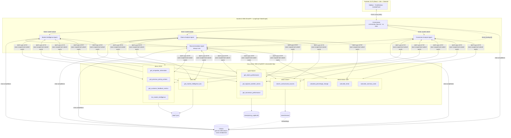
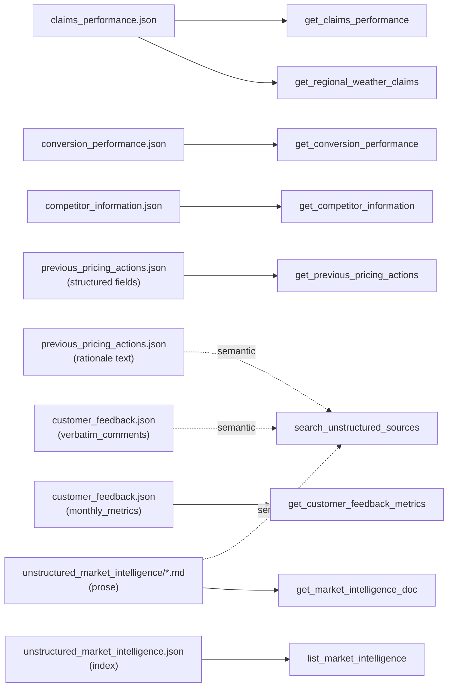

# Implementation Notes — Pricing Analyst Copilot

Build for Challenge B (`challenge.md`): an AI agent that acts as a
Pricing Analyst Copilot over 6 synthetic Aviva UK motor insurance data
sources, implemented as a 5-agent LangGraph split (the bonus multi-agent
ask, not just the baseline single-agent build). This doc covers the
high-level design, the retrieval/chunking strategy, the tool catalog, and
the multi-agent/skills design — written once the build was working end to
end, for anyone picking this up next (including the one remaining
future-phase item in `plan_phase_2.md`: continuous evaluation/model drift).

## 1. High-level design

Three independent processes/services, so the project doubles as a working
example of wiring an LLM agent to a real internal data API over MCP rather
than importing tool code directly. See the root [README.md](README.md) for
the request-flow sequence diagram; the diagram below is the same 3 services
but expanded to show every tool and where it reads from:



- **`mcp_server`** — a FastMCP server exposing 13 tools across 4 retrieval
  techniques (§2, §4). It owns all access to `data/`, `store/pricing_copilot.db`,
  and `store/chroma/` — nothing outside this process touches those files
  directly. Runs standalone on its own port so it's a genuine service the
  agent talks to over the network, not an in-process import. It has no
  concept of the multi-agent split below — it just serves 13 tools to
  whichever client asks; scoping happens entirely on the `backend` side.
- **`backend`** — a FastAPI service running a 5-agent LangGraph `StateGraph`
  (`backend/graph.py`): an Orchestration Agent (no tools) reads the question
  and routes it, via LangGraph's `Send` API, to whichever of 3 domain
  specialists are relevant, running them in parallel; a Recommendation Agent
  always runs last, reading the specialists' condensed findings plus its own
  tools. Each of the 4 tool-using agents is its own
  `langgraph.prebuilt.create_react_agent` instance, bound only to its own
  scoped subset of the MCP server's tools via `langchain-mcp-adapters`, with
  a system prompt assembled from only its own subset of `skills/*.md`.
  `POST /chat` streams every agent's steps to the client over Server-Sent
  Events as they happen (which domains were routed to, tool calls, tool
  results, final answer) rather than blocking until the whole run finishes —
  see §5 and §7 for how the split and the streaming work.
- **`frontend`** — a three-column React app: session-history sidebar, a
  scrolling chat column where each answer renders as a structured card, and
  a right-hand panel that's a live per-agent-grouped retrieval trace, a
  static reference of the 5 agents, and a static reference of the tool
  catalog.

One shared `pyproject.toml`/`uv` environment covers `mcp_server` and
`backend` — they're separated at the process/network level (that's what
makes this a microservice architecture), not at the dependency-tree level,
since splitting Python packages for a 2-service demo would add packaging
overhead with no runtime benefit.

## 2. Data → retrieval-technique mapping

Every source file's retrieval technique was chosen individually based on its
actual shape, not assigned by rough category:

| Source | Technique | Why |
|---|---|---|
| `claims_performance.json` → `records` | SQLite | Relational, numeric, fixed filter dimensions (segment/period), always queried the same way |
| `claims_performance.json` → `regional_weather_claims` | SQLite | Same; this is the real regional axis (see quirk below) |
| `conversion_performance.json` | SQLite | Relational, 144 rows, joins to claims via identical segment strings |
| `competitor_information.json` | Direct JSON query | 24 records, small, nested per-competitor dict doesn't need to be relational |
| `previous_pricing_actions.json` (structured fields) | Direct JSON query | 10 records, predictable structured filters |
| `previous_pricing_actions.json` (`rationale` text) | Vector DB | Free text; "has this been tried before" doesn't map to a fixed filter |
| `customer_feedback.json` → `monthly_metrics` | Direct JSON query | 12 structured monthly rows |
| `customer_feedback.json` → `verbatim_comments` | Vector DB | 10 free-text comments, needs semantic matching |
| `unstructured_market_intelligence.json` (index) | Direct JSON query | 18 small structured records, filter-style questions |
| `unstructured_market_intelligence/*.md` (prose) | Vector DB + direct file read | Genuinely unstructured; semantic search for discovery, raw file for drill-down |
| *(any retrieved numeric series)* | Deterministic Python | LLMs make arithmetic errors on multi-point series |

The same information as a graph — note the two sources that fan out into more
than one technique, which is the core "pick the technique per query shape,
not per file" idea in one picture:



Two design refinements came out of reviewing the data before building against
it (see `mcp_server/sql_tools.py` and `build_vector_index.py`):

- `unstructured_market_intelligence` is really three retrieval shapes: the
  18-record JSON index (structured filter — `list_market_intelligence`), the
  markdown prose (semantic search — `search_unstructured_sources`), and
  full-text drill-down (direct file read — `get_market_intelligence_doc`).
  Same nominal source, three techniques, because the query shapes differ.
- `previous_pricing_actions.json`'s `rationale` field is free text inside an
  otherwise structured record — it's dual-indexed: a typed JSON filter for
  structured queries, and also embedded into the vector store for "have we
  tried this before" semantic questions.

No source data values needed to change. The one real ragged-data case —
`conversion_performance.json`'s `average_pcw_rank` being entirely absent
(not `null`) on non-PCW-channel rows, because only the PCW channel has a
"rank" concept — is handled in the SQLite loader (`record.get(...)`
defaulting to `NULL`), not by editing the source JSON.

## 3. Chunking strategy

No sliding-window/recursive chunking was used — every embedded item is a
single chunk. This was a deliberate choice, not an oversight: all three
embedded sources are already short, self-contained units (a market
intelligence article is a few paragraphs, a customer comment is a sentence
or two, a pricing-action rationale is one sentence), so splitting them
further would only fragment context that belongs together and add retrieval
complexity with no recall benefit. 38 chunks total: 18 market intelligence
docs + 10 feedback comments + 10 pricing-action rationales, one Chroma
collection (`unstructured_sources`), disambiguated by a `source` metadata
field so a single search tool can filter to one source or search across all
three. Embeddings via Ollama's `nomic-embed-text`.

If a future data source had genuinely long documents (multi-page reports),
that would call for real chunking (e.g. recursive character splitting with
overlap) — worth revisiting if `data/` grows that kind of source later.

## 4. Tool catalog (13 tools, `mcp_server/`)

**Direct JSON** (`json_tools.py`) — load once at server start, filter
in-memory, return only matching records:
`get_competitor_information`, `get_previous_pricing_actions`,
`get_customer_feedback_metrics`, `list_market_intelligence`,
`list_demo_scenarios` (example analyst questions, added to answer
"what can you do" meta-questions — see §5).

**Direct file read** (`file_tools.py`): `get_market_intelligence_doc(id)`.

**SQLite, typed only** (`sql_tools.py`) — no raw-SQL tool exists, by design:
`get_claims_performance`, `get_regional_weather_claims`,
`get_conversion_performance`. Every filter parameter's docstring lists the
exact valid values (segment names, channel names, product line, date range)
rather than leaving the agent to guess — an early test run showed the agent
guessing plausible-but-wrong values (`"Young Driver"` instead of
`"Young Driver (17-25)"`, `"Private Car Motor"` instead of `"Private Car
Motor - Comprehensive"`) and silently getting empty results back. Exact
enums in the docstring fixed this immediately.

**Vector DB** (`vector_tools.py`): `search_unstructured_sources(query,
source?, top_k=5)` — returns short excerpts and metadata only, never full
documents.

**Deterministic math** (`math_tools.py`) — no LLM arithmetic:
`calculate_percentage_change`, `calculate_trend`, `calculate_summary_stats`.
Pure Python (`statistics` module), given the retrieved values as input.

Every tool returns compact, pre-filtered JSON, never a whole source file —
this is the actual mechanism for keeping the LLM's context minimal, more
than any prompt instruction. The skills additionally instruct the model to
drop irrelevant tool results before answering, and the graph only carries
the agent's condensed textual state forward, not raw tool-call payloads.

## 5. Skills and the multi-agent split

`skills/` holds one markdown file per required capability
(`retrieve_information`, `summarise_findings`, `highlight_trends`,
`identify_investigation_areas`, `recommend_pricing_actions`,
`explain_reasoning`), a routing-only file (`orchestrate_flow.md`), a
meta-question file (`describe_capabilities.md` — see below), and the
original single-agent `master_orchestrator.md` (no longer wired into the
graph — see below). Each of the phase skills follows the same template —
purpose, when to use it, which tools to call and how, output shape, one
worked example grounded in `demo_scenarios.json` — so a skill file is
directly checkable against real data rather than aspirational prose. See
`skills/README.md` for the full file-by-file breakdown.

`backend/skill_loader.py`'s `build_system_prompt(skill_names)` was written
from the start to accept a subset of skill names, not a hardcoded constant —
even in the earliest single-agent version of this project, before the
multi-agent split existed, specifically so that split wouldn't require
touching this file. That seam paid off directly: `backend/graph.py`'s
`SPECIALISTS` dict now hands each specialist agent only its own skill
subset and its own MCP tool subset:

| Agent | Skills | Tools |
|---|---|---|
| Orchestrator | `orchestrate_flow` | none |
| Market Intelligence | `retrieve_information`, `summarise_findings`, `highlight_trends` | `list_market_intelligence`, `get_market_intelligence_doc`, `search_unstructured_sources` |
| Claims Analysis | `retrieve_information`, `highlight_trends`, `identify_investigation_areas` | `get_claims_performance`, `get_regional_weather_claims`, `calculate_trend`, `calculate_summary_stats` |
| Conversion Analysis | `retrieve_information`, `highlight_trends` | `get_conversion_performance`, `get_competitor_information`, `calculate_percentage_change` |
| Recommendation | `recommend_pricing_actions`, `explain_reasoning`, `describe_capabilities` | `get_previous_pricing_actions`, `search_unstructured_sources`, `get_customer_feedback_metrics`, `list_demo_scenarios` |

**Orchestrator**: `orchestrate_node` has no tools at all — it classifies the
question into a subset of `{market, claims, conversion}` using
`orchestrate_flow.md` as its entire system prompt (see §6 for how the
routing decision itself is obtained reliably from the model). **Fan-out**:
`route_to_specialists`, a LangGraph conditional edge, dispatches one
`Send(f"{name}_agent", {"query": ...})` per routed domain — these run
concurrently, each as an independent `create_react_agent` with its own
private message history. If routing came back empty (the question is really
about customer feedback or prior pricing actions — both are the
Recommendation Agent's own tool scope, not any specialist's), a single
`Send("recommend", ...)` goes straight to the Recommendation Agent instead,
so no specialist runs needlessly — this same empty-routing path also covers
meta-questions about the copilot itself ("what can you do," "give me
example scenarios"), per `orchestrate_flow.md`'s explicit routing rule for
them. **Fan-in**: each specialist's final
message becomes one condensed findings string, written to its own
`GraphState` field (`market_findings`/`claims_findings`/`conversion_findings`)
— never its raw tool-call history, which stays private to that agent (§7
has the full state design). **Recommendation Agent**: reads whichever
findings fields are non-`None`, formats them as labeled context, and answers
using its own tools plus `recommend_pricing_actions.md`/`explain_reasoning.md`
— or, for a meta-question, `describe_capabilities.md` plus `list_demo_scenarios`
instead. That tool deliberately returns only each scenario's `scenario_id`,
`title`, and the example question text (`json_tools.py`'s `list_demo_scenarios`)
— never the recorded `key_findings`/`recommended_action`/`reasoning`. If a real
analyst question happened to match one of the 10 demo scenarios, exposing the
answer key would let the Recommendation Agent parrot the recorded answer
instead of deriving it from `get_claims_performance` etc. — quietly breaking
the "every claim traces to a retrieved fact" property the whole trace UI
exists to demonstrate, and poisoning any future eval harness run against
these same scenarios (`plan_phase_2.md` §3).

One enforcement detail worth noting: scoping isn't just a prompt
suggestion. Each specialist's own `create_react_agent` is bound to a
filtered tool list (`graph.py`'s `_scope_tools`), so if the model tries to
call a tool outside its subset, the `ToolNode` rejects it with a "not a
valid tool, try one of [...]" error and the specialist recovers using its
real tools — observed once during testing (the Market Intelligence Agent
attempted `get_claims_performance`, a Claims-only tool, and got a clean
rejection). The failure mode is graceful, not silent success on the wrong
data.

## 6. Structured final answer, and cards in the UI

`backend/schema.py` defines `PricingAnalysis` (`summary`, `trends`,
`investigation_areas`, `recommendation`, `reasoning` - one field per
post-retrieval skill), and the frontend renders each as its own card instead
of one free-text blob. The retrieval trace is similarly split into per-call
cards tagged with a `category` (`json`/`file`/`sql`/`vector`/`math`, from
`backend/graph.py`'s `TOOL_CATEGORIES`) and, since the multi-agent split,
also an `agent` tag (which of the 5 agents made the call) so both the four
retrieval techniques in §4 and the 5-agent split are visibly distinguishable
while the demo runs, not just documented here — see §7 for how per-tool
events reach the frontend live from inside 3 concurrently-running agents.

Getting the structured final answer out of the model reliably took two
failed attempts worth noting: `create_react_agent`'s built-in
`response_format` parameter (a separate structured-output model call after
the ReAct loop finishes) failed against `gpt-oss:120b-cloud` two different
ways - its default `method="json_schema"` returned an empty response, and
`method="function_calling"` with a forced `tool_choice` returned no tool call
either. Both are quirks in a code path this project doesn't otherwise
exercise. The working approach instead reuses the exact mechanism already
proven reliable all session (the final free-text ReAct turn): the system
prompt asks the model to emit JSON matching `PricingAnalysis` in its last
message, and `backend/graph.py`'s `_parse_final_answer` parses it
client-side via `PydanticOutputParser`, falling back to putting the raw text
in `recommendation` if parsing ever fails rather than crashing the turn.

**The identical quirk resurfaced independently while building the
Orchestration Agent's routing decision** (`graph.py`'s `orchestrate_node`),
which needs the LLM to return a small structured `{"agents": [...]}` value —
this is a plain LangChain `.with_structured_output()` call, not
`create_react_agent`'s `response_format`, but hit the same two failure modes
against the same model: `method="json_schema"` (the default) returned
free-text prose instead of JSON (`OutputParserException`), and
`method="function_calling"` returned `content='[]'` with an *empty*
`tool_calls` list — the model simply declined to invoke the pseudo-tool.
Fixed identically: plain `ainvoke` + `PydanticOutputParser.get_format_instructions()`
in the prompt + `parser.parse()` client-side. The one difference from the
final-answer case is the fallback on a genuine parse failure: routing falls
back to all 3 domains (safe-but-wasteful) rather than an empty list, since an
empty routing decision is a real, valid outcome (see §7) that must stay
distinguishable from "the model's output couldn't be parsed at all."
Verified against both a multi-domain question and a customer-feedback-only
question via `backend/run_cli.py` — the second one correctly parses to
`{"agents": []}` rather than tripping the fallback.

## 7. State management and live multi-agent streaming

`backend/graph.py`'s `GraphState`:

```python
class GraphState(TypedDict):
    query: str
    routing: list[str]                 # subset of ["market", "claims", "conversion"]
    market_findings: str | None
    claims_findings: str | None
    conversion_findings: str | None
    final_answer: dict[str, Any] | None
```

The design goal was that each agent should hold only the context relevant
to its own job, not a shared blob every agent reads and writes. Two
mechanisms make that true:

- **Each specialist's tool-call scratchpad is private.** A specialist's own
  `create_react_agent` keeps its own internal `messages` list for the
  duration of its run (the back-and-forth of calling a tool, reading the
  result, deciding the next call). That list is never written into
  `GraphState` — only the specialist's single final message (its condensed
  findings, one string) crosses back, into its own dedicated field. The
  Recommendation Agent never sees, say, the Claims Analysis Agent's raw tool
  calls, only its distilled conclusion. Since the 3 specialist fields are
  disjoint keys with no shared reducer, LangGraph's default per-key
  last-write-wins merge is sufficient for the parallel `Send` branches to
  fan back in without conflict — no custom reducer needed.
- **`GraphState` is rebuilt fresh per question.** `backend/agent.py`'s
  `stream_query` constructs a new all-empty `GraphState` per `POST /chat`
  call; there is no cross-turn persistence yet (the backend is stateless —
  see §8), so a specialist the orchestrator doesn't route to for this
  question simply never has its field written. A future multi-turn/session
  feature would need an explicit per-turn reset of the 4 answer-shaped
  fields while keeping a running message history for follow-up context —
  sketched in `plan_phase_2.md` §2, not built here.

**The live-streaming problem this creates, and how it's solved**: if a
specialist's tool-call history is private and never touches `GraphState`,
how does the frontend still see every individual tool call live, from 3
agents running concurrently? Streaming the *outer* graph
(`graph.astream(inputs, stream_mode="updates")`) only reports one state
delta per node per superstep — it would only show *whether* a specialist
finished, not each of its intermediate tool calls, since those live inside
a nested `create_react_agent` invocation the outer stream can't see into.
The fix is `langgraph.config.get_stream_writer()`: called from inside
`_run_specialist` (which every tool-using agent shares), it pushes a
`{"type": "tool_call"|"tool_result", "agent": <name>, ...}` dict directly
into the *outer* graph's stream as a `"custom"`-mode chunk, at the moment
each inner tool call/result happens — bypassing `GraphState` entirely.
`backend/agent.py` drives the graph with
`stream_mode=["updates", "custom"]` and forwards `"custom"` chunks to the
frontend as-is, while reading `"updates"` chunks only for the final
`PricingAnalysis` answer. This is why per-tool live streaming survived the
move from one agent to five agents with private per-agent state, rather
than the two being in tension.

**Routing when no specialist applies**: `route_to_specialists` (the
conditional edge after the orchestrator) special-cases an empty routing
decision — a question that's purely about customer feedback or prior
pricing actions, both the Recommendation Agent's own tool scope — by
`Send`-ing straight to `recommend` rather than to any specialist. Without
this, an empty `Send(...)` list would leave the graph with no active
outgoing branch from `orchestrate`, and `recommend` (which is only wired via
edges *from* the 3 specialists) would never run at all. Verified end-to-end
via `run_cli.py`: a customer-feedback-only question produces a `routing`
event with an empty list, zero specialist tool calls, and a normal final
answer from the Recommendation Agent alone.

## 8. Repo conventions and UI (Phase 1b)

The `agent_api/` service was renamed to `backend/` to match the "frontend / backend / MCP server" framing
used throughout the project. Repo-level conventions were formalized this round: a per-service `README.md`
for each of `mcp_server/`, `backend/`, `frontend/`, `skills/`, `data/`, and `store/`, a root `README.md` with
Mermaid architecture/sequence diagrams and a "Folder READMEs" index, and a root `.env.example`.

The frontend was rebuilt as a three-column chat interface (Tailwind CSS v4, Inter + Playfair Display,
dark/light theme) instead of a single-column form-and-results page: a session-history sidebar, a scrolling
chat column where each `PricingAnalysis` renders as one structured card per turn, and a right-hand
`ActivityPanel` with 4 tabs — Trace (live, grouped into a section per agent with a routing banner showing
which domains the orchestrator picked), Agents (static reference of all 5 agents — role, skills, tool
subset), Skills (static reference of all 9 skill files), and Tools (static reference of all 13 MCP tools
grouped by retrieval technique). The backend
remains stateless — each question is answered independently, with a fresh `GraphState` per call (§7); the
frontend just displays the running list of turns for a conversational feel, rather than the backend gaining
real cross-turn memory (that's still a `plan_phase_2.md` concern, if wanted at all).

## 9. Known limitation

`gpt-oss:120b-cloud` (Ollama's hosted proxy model) occasionally returns a
transient 500 on longer, tool-heavy conversations (observed after 4-5
sequential tool calls in one turn). There's no per-call retry hook that
survives `create_react_agent`'s `bind_tools()` wrapping, so
`backend/agent.py` retries the whole graph run (up to 3 attempts) rather
than a single failed call. Switching to a fully local model via the
`OLLAMA_CHAT_MODEL` env var avoids this entirely if it becomes disruptive
during a live demo.

## 10. Data dashboard

A second frontend view (`Header`'s Copilot/Dashboard toggle) shows the underlying data directly, without
going through the agent at all. `backend/dashboard.py` calls the same MCP tools as the chat agent, but
bypasses the LLM entirely (no `create_react_agent`, no tool-choice reasoning) — a `GET /dashboard` request
is a handful of direct MCP tool calls plus light aggregation (mean conversion rate by channel, sentiment
counts), returned as one JSON payload. This is deliberately a separate code path from `agent.py`, not the
agent with an empty prompt: the dashboard's job is "show me the data," not "reason about the data," so it
shouldn't pay for or depend on an LLM call.

The charts (`frontend/src/components/dashboard/{LineChart,BarChart}.tsx`) are hand-rolled SVG rather than a
charting library dependency, built against the dataviz skill's validated default categorical palette
(`frontend/src/index.css`'s `--viz-series-*` custom properties, light and dark) and mark specs (2px lines,
≥8px end-markers with a 2px surface ring, hairline gridlines, a hover crosshair+tooltip, a legend for
multi-series charts). The one deliberate deviation from strict categorical assignment: the competitor
premium bar chart uses a 2-color identity split (Aviva vs. everyone else) rather than one hue per
competitor, because "us vs. the market" is the actual comparison being made, not eight independent
categories.
