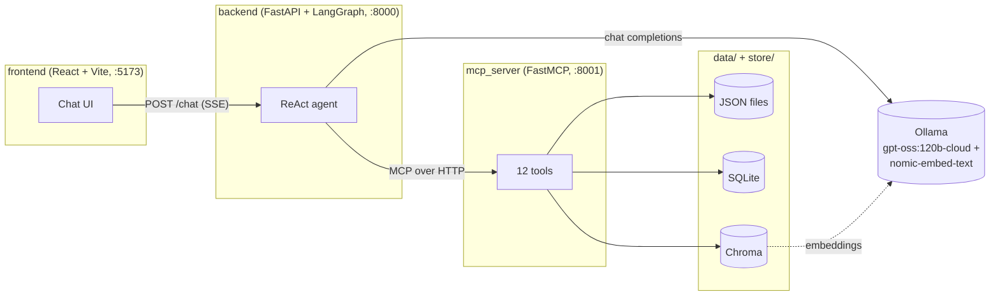
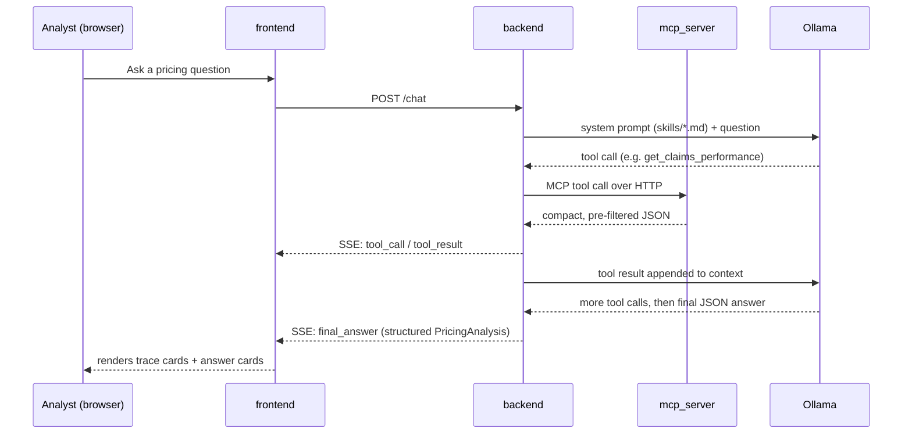

# Pricing Analyst Copilot

An AI agent that acts as a Pricing Analyst Copilot for Aviva UK Private Car Motor Insurance — it retrieves
across claims, conversion, competitor, market-intelligence, customer-feedback, and prior-pricing-action
data, summarises findings, highlights trends, flags what needs investigation, and recommends (or explicitly
declines to recommend) a pricing action with cited reasoning.

Built as three independent services — an MCP data server, a FastAPI/LangGraph backend, and a React
frontend — to double as a demo of MCP tool design: how different data shapes (relational, small structured,
free-text) map to different retrieval techniques (SQLite, direct JSON, vector search), and how an LLM agent
connects to that as a genuine network service rather than an in-process import.

See [IMPLEMENTATION.md](IMPLEMENTATION.md) for the full design rationale, [CLAUDE.md](CLAUDE.md) for repo
conventions, and [plan_phase_2.md](plan_phase_2.md) for what's deliberately not built yet.

## Architecture



## Request flow



## Tech stack

| Concern | Choice |
|---|---|
| MCP server | Python, FastMCP, streamable-http transport |
| Backend | Python, FastAPI, LangGraph, langchain-mcp-adapters |
| LLM | Ollama (`gpt-oss:120b-cloud` chat, `nomic-embed-text` embeddings) |
| Structured data | SQLite (typed queries only) |
| Unstructured data | Chroma vector store |
| Frontend | React 19, Vite, TypeScript, Tailwind CSS v4 |

## Services & ports

| Service | Port | Run command |
|---|---|---|
| `mcp_server` | 8001 | `uv run mcp_server/server.py` |
| `backend` | 8000 | `uv run uvicorn app:app --app-dir backend --port 8000` |
| `frontend` | 5173 | `cd frontend && npm run dev` |
| Ollama | 11434 | runs on the host, not part of this repo |

## Environment variables

See [.env.example](.env.example) for the full list (chat/embedding models, service URLs).

## Quick start

```bash
# 1. Build the data stores (one-off)
uv run mcp_server/build_db.py
uv run mcp_server/build_vector_index.py

# 2. Start all 3 services (separate terminals)
uv run mcp_server/server.py
uv run uvicorn app:app --app-dir backend --port 8000
cd frontend && npm install && npm run dev

# 3. Open http://localhost:5173
```

Requires [Ollama](https://ollama.com) running locally with `gpt-oss:120b-cloud` (or a local model of your
choice — see `.env.example`) and `nomic-embed-text` pulled.
