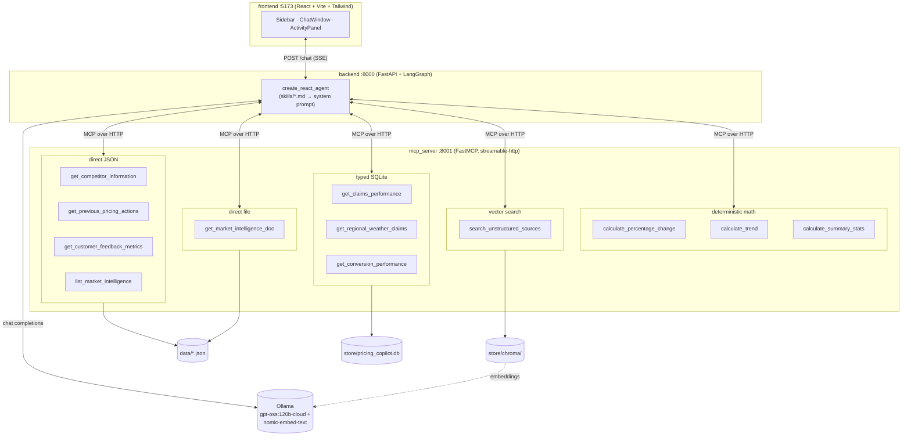
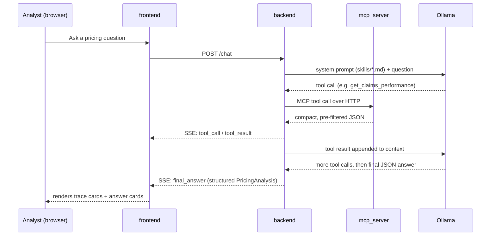
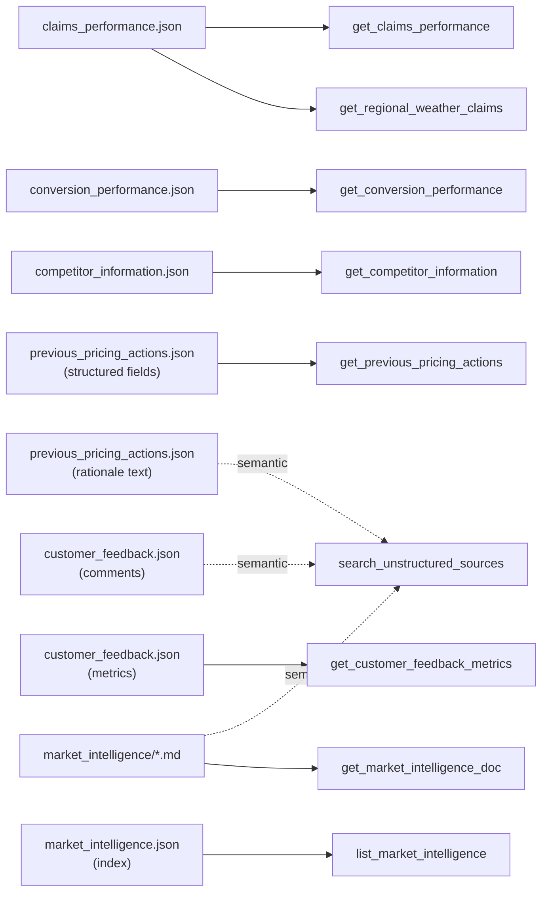
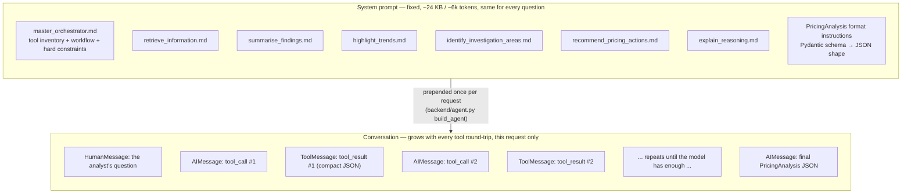

# Pricing Analyst Copilot

An AI agent that acts as a Pricing Analyst Copilot for Aviva UK Private Car Motor Insurance — it retrieves
across claims, conversion, competitor, market-intelligence, customer-feedback, and prior-pricing-action
data, summarises findings, highlights trends, flags what needs investigation, and recommends (or explicitly
declines to recommend) a pricing action with cited reasoning.

Built as three independent services — an MCP data server, a FastAPI/LangGraph backend, and a React
frontend — to double as a demo of MCP tool design: how different data shapes (relational, small structured,
free-text) map to different retrieval techniques (SQLite, direct JSON, vector search), and how an LLM agent
connects to that as a genuine network service rather than an in-process import.

See [IMPLEMENTATION.md](IMPLEMENTATION.md) for the full design rationale, [CLAUDE.md](CLAUDE.md) for repo
conventions, and [plan_phase_2.md](plan_phase_2.md) for what's deliberately not built yet.

## Architecture

Three independent services, each its own process/port — `backend` never imports `mcp_server`'s tool code,
it only ever talks to it over HTTP as an MCP client, the way it would talk to a real internal data API:



**Why three separate services instead of one process:** it mirrors how this would actually be built inside
Aviva — `mcp_server` stands in for a real internal data API that a pricing team doesn't own, `backend` is
the team's own agent logic, and `frontend` is the analyst-facing app. Keeping them as separate
processes/ports (rather than importing `mcp_server`'s Python modules directly into `backend`) forces the
same interface discipline you'd get talking to someone else's service: `backend` can only ask for what the
MCP tool contracts expose, never reach into SQLite or the JSON files directly. That's also what makes the
tool catalog in `mcp_server/` swappable later for a real Aviva API without `backend` changing at all.

## Request flow



**Why SSE and not a single request/response:** the agent can take several tool round-trips to answer one
question, and the frontend's activity panel is meant to show that reasoning live (which tool, what args,
what came back) rather than only the final card once everything finishes. A plain JSON response would force
the frontend to wait in silence for however many tool calls the ReAct loop makes; streaming each
`tool_call`/`tool_result` event as it happens is what makes the trace panel meaningful instead of decorative.

## Data retrieval design

Every source file's retrieval technique was picked individually by its actual shape, not assigned by a
blanket rule — two sources even fan out into more than one technique because a single file can contain
both predictably-structured fields and genuine free text:



**Why per-source, not a blanket rule:** "use SQL for structured data, vector search for text" sounds like a
clean rule but breaks the moment one JSON file contains both — `previous_pricing_actions.json` has typed
fields (`segment`, `date`, `action_type`) alongside a free-text `rationale`, so it's indexed twice: once as a
typed JSON filter, once embedded for "have we tried something like this before" semantic questions. Picking
the technique by the actual shape of each field, rather than by which file it lives in, is what keeps every
tool's results genuinely compact — a vector search over `rationale` text never has to also carry the
structured fields, and a typed filter never has to fuzzy-match prose.

See [IMPLEMENTATION.md](IMPLEMENTATION.md) §2 for the full source-by-source rationale.

## What goes into the LLM's context

Every `POST /chat` call sends Ollama a context built from two independent pieces — a **fixed system
prompt** (the same on every request, regardless of what's asked) and a **growing conversation** (unique to
this request, built turn-by-turn as the ReAct loop runs):



Concretely, from `backend/agent.py` and `backend/skill_loader.py`:

- `build_system_prompt()` concatenates **all 7** `skills/*.md` files, unconditionally, every time —
  `ALL_SKILLS` is passed as the default and nothing in Phase 1 ever calls it with a subset.
- `_output_parser.get_format_instructions()` appends the full `PricingAnalysis` JSON-schema description on
  top of that.
- `create_react_agent`'s own loop then keeps **every** tool call and **every** tool result in the message
  list for the rest of that request — nothing is dropped or summarised mid-conversation, so a question that
  takes 6 tool calls to answer is paying for all 6 results' worth of tokens by the time the model writes the
  final answer, even if the first 2 turned out to be dead ends.

Why it's built this way for Phase 1: a single `create_react_agent` needs one system prompt, and having
`build_system_prompt` already accept a `skill_names` subset (not just hardcode the concatenation) was a
deliberate seam left for Phase 2's multi-agent split, not something this phase exercises — see
`plan_phase_2.md` and `IMPLEMENTATION.md` §5. Reaching for that complexity now, before Phase 1's simpler
single-agent design was proven, would have been solving a scaling problem before confirming there was one.

## Making context query-specific

The two pieces above are also the two places to cut context that isn't relevant to a given question:

**1. Route to a subset of skills instead of all 7.** `build_system_prompt(skill_names)` already supports
this — it just isn't called that way yet. A cheap classification step (either a fast/small LLM call, or
even keyword matching against each skill's "when to use it" section) could pick, say, only
`retrieve_information` + `highlight_trends` for "how has young driver loss ratio moved this year," skipping
`recommend_pricing_actions` and `explain_reasoning` entirely when the question never asks for a
recommendation. This is the single biggest lever: `master_orchestrator.md` (6.3 KB) is unavoidable since it
carries the tool inventory and hard constraints, but the other 6 skills are ~2.5–3.8 KB each and most
questions only need one or two of them.

**2. Narrow which of the 12 tools are bound to the agent per request.** `mcp_client.get_mcp_tools()`
currently fetches and binds all 12 tools regardless of question shape. If skill routing picks
`retrieve_information` + `highlight_trends` only, the agent only needs the SQL/JSON/vector tools plus the
math tools — not `recommend_pricing_actions`' or `explain_reasoning`'s tools (there's no such split today
since it's one skill = one prompt section, not one skill = one tool subset, but that mapping already exists
implicitly in which tools each skill file tells the agent to call).

**3. Trim stale tool results out of the running conversation.** Right now a tool result that turned out
irrelevant (e.g. the agent queried `get_claims_performance` for the wrong segment, got empty rows, and
re-queried) stays in the message list for the rest of the request. A summarization/pruning step between
ReAct iterations — collapsing old `ToolMessage`s into a short textual note once their data has been folded
into the model's reasoning — would keep the context flat rather than monotonically growing across a long
tool-calling chain.

**4. Cache the fixed part.** Since the system prompt is identical across requests (until skill routing makes
it request-dependent), Ollama-side prompt caching means the ~6k fixed tokens are only fully re-processed
once per distinct skill-subset combination, not once per request — worth confirming this is actually
enabled/effective for the chosen model rather than assumed.

None of this is built yet — Phase 1 optimizes for correctness and traceability (every tool call is visible
in the activity panel) over token efficiency, and the unconditional `ALL_SKILLS` + all-12-tools setup is
simple to reason about and debug. It's the natural next optimization once the always-all-skills prompt
becomes a real latency/cost problem rather than a theoretical one.

## Tech stack

| Concern | Choice |
|---|---|
| MCP server | Python, FastMCP, streamable-http transport |
| Backend | Python, FastAPI, LangGraph, langchain-mcp-adapters |
| LLM | Ollama (`gpt-oss:120b-cloud` chat, `nomic-embed-text` embeddings) |
| Structured data | SQLite (typed queries only) |
| Unstructured data | Chroma vector store |
| Frontend | React 19, Vite, TypeScript, Tailwind CSS v4 |

## Services & ports

| Service | Port | Run command |
|---|---|---|
| `mcp_server` | 8001 | `uv run mcp_server/server.py` |
| `backend` | 8000 | `uv run uvicorn app:app --app-dir backend --port 8000` |
| `frontend` | 5173 | `cd frontend && npm run dev` |
| Ollama | 11434 | runs on the host, not part of this repo |

## Environment variables

See [.env.example](.env.example) for the full list (chat/embedding models, service URLs).

## Quick start

```bash
# 1. Build the data stores (one-off)
uv run mcp_server/build_db.py
uv run mcp_server/build_vector_index.py

# 2. Start all 3 services (separate terminals)
uv run mcp_server/server.py
uv run uvicorn app:app --app-dir backend --port 8000
cd frontend && npm install && npm run dev

# 3. Open http://localhost:5173
```

Requires [Ollama](https://ollama.com) running locally with `gpt-oss:120b-cloud` (or a local model of your
choice — see `.env.example`) and `nomic-embed-text` pulled.
