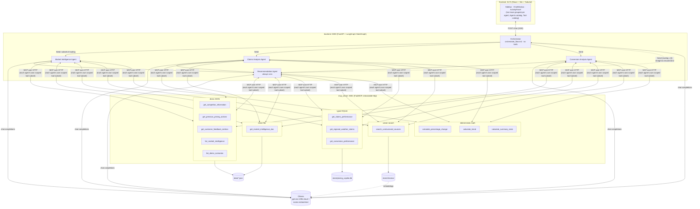
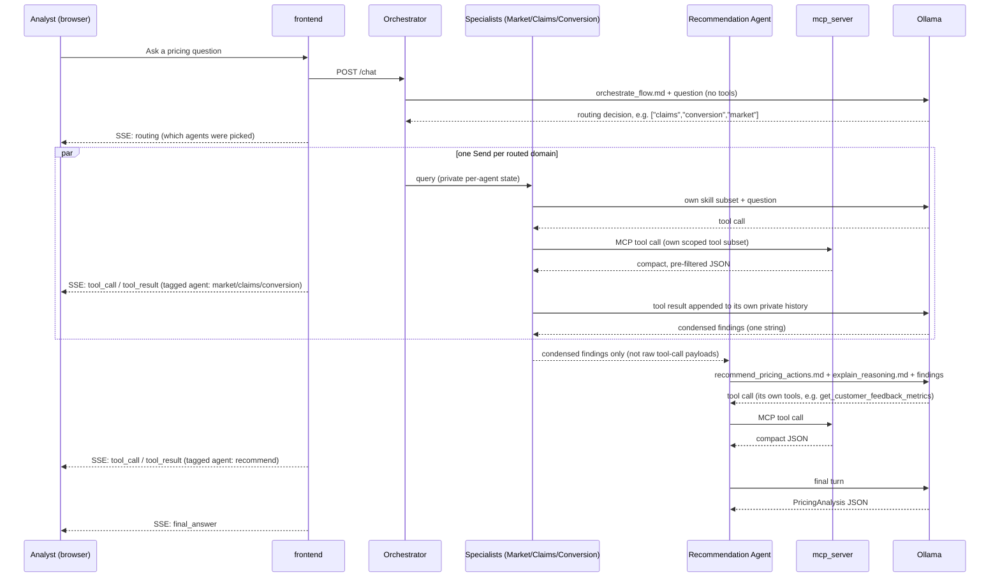
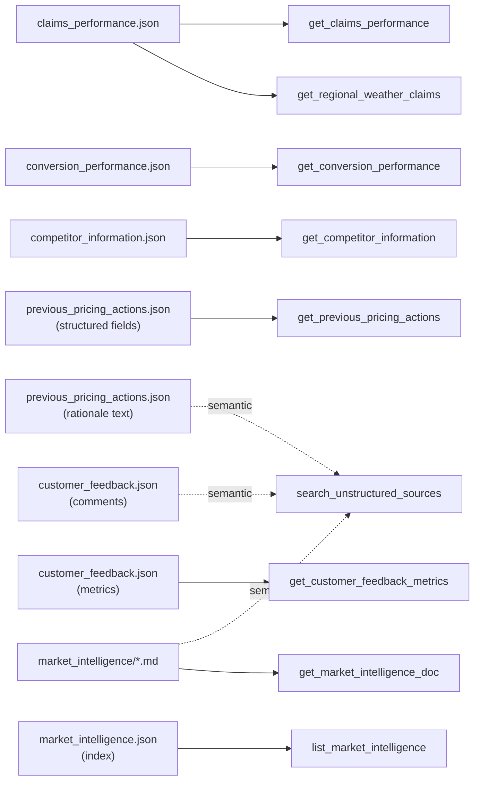

# Pricing Analyst Copilot

An AI agent that acts as a Pricing Analyst Copilot for Aviva UK Private Car Motor Insurance — it retrieves
across claims, conversion, competitor, market-intelligence, customer-feedback, and prior-pricing-action
data, summarises findings, highlights trends, flags what needs investigation, and recommends (or explicitly
declines to recommend) a pricing action with cited reasoning.

Built as three independent services — an MCP data server, a FastAPI/LangGraph backend, and a React
frontend — to double as a demo of two things at once: how different data shapes (relational, small
structured, free-text) map to different retrieval techniques (SQLite, direct JSON, vector search); and how
a single "do everything" agent can be split into a small team of scoped specialist agents that route,
retrieve, and recommend in parallel, each with only the tools and instructions its own job needs.

See [IMPLEMENTATION.md](IMPLEMENTATION.md) for the full design rationale and [plan_phase_2.md](plan_phase_2.md)
for what's still deliberately not built (continuous evaluation / model-drift monitoring — the multi-agent
split it also proposed is now built and described below).

## Architecture

Three independent services, each its own process/port — `backend` never imports `mcp_server`'s tool code,
it only ever talks to it over HTTP as an MCP client, the way it would talk to a real internal data API.
`backend` itself is a 5-agent LangGraph `StateGraph`, not a single agent: an Orchestration Agent reads the
question and routes it to whichever of 3 domain specialists are relevant (in parallel), and a Recommendation
Agent always runs last, reading the specialists' condensed findings plus its own tools:



**Why three separate services instead of one process:** it mirrors how this would actually be built inside
Aviva — `mcp_server` stands in for a real internal data API that a pricing team doesn't own, `backend` is
the team's own agent logic, and `frontend` is the analyst-facing app. Keeping them as separate
processes/ports (rather than importing `mcp_server`'s Python modules directly into `backend`) forces the
same interface discipline you'd get talking to someone else's service: `backend` can only ask for what the
MCP tool contracts expose, never reach into SQLite or the JSON files directly. That's also what makes the
tool catalog in `mcp_server/` swappable later for a real Aviva API without `backend` changing at all.

**Why 5 agents instead of 1:** `challenge.md` names four specialist roles as a bonus ask (Market
Intelligence, Claims, Conversion, Recommendation); a 5th Orchestration Agent sits above them purely to
route. Each specialist gets only its own skill subset and its own MCP tool subset — `backend/graph.py`'s
`SPECIALISTS` dict is the single source of truth for this scoping. This is a genuine architectural split,
not cosmetic: each specialist runs as its own `create_react_agent` instance with its own private message
history (its tool-call back-and-forth is never shared with the other agents), and only a single condensed
findings string crosses back into the shared graph state per agent — see "State management" below.

## Request flow



**Why SSE and not a single request/response:** the graph can take several parallel tool round-trips across
multiple agents to answer one question, and the frontend's activity panel is meant to show that live
(routing decision, which agent is calling which tool, what came back) rather than only the final card once
everything finishes. A plain JSON response would force the frontend to wait in silence; streaming each
`routing`/`tool_call`/`tool_result` event as it happens, tagged with which agent produced it, is what makes
the trace panel a genuine multi-agent trace instead of a single undifferentiated list.

**How live per-tool streaming survives agent-private state**: each specialist's own tool-call loop runs
inside `backend/graph.py`'s `_run_specialist` helper, which calls `langgraph.config.get_stream_writer()` to
push `tool_call`/`tool_result` events directly into the outer graph's stream as they happen — this happens
*before* the specialist's private message history is collapsed into its one condensed findings string, so
the frontend still sees every individual tool call from every concurrently-running specialist, tagged with
`agent`, even though none of that detail ever enters the shared graph state.

## State management

Each agent gets only the context relevant to its own job — this is deliberate, not an accident of the
`Send` API. `backend/graph.py`'s `GraphState`:

```python
class GraphState(TypedDict):
    query: str
    routing: list[str]                 # orchestrator's decision, subset of ["market","claims","conversion"]
    market_findings: str | None        # written only by the Market Intelligence Agent
    claims_findings: str | None        # written only by the Claims Analysis Agent
    conversion_findings: str | None    # written only by the Conversion Analysis Agent
    final_answer: dict | None          # written only by the Recommendation Agent
```

Two different lifetimes matter here:

- **A specialist's own tool-call scratchpad** (the back-and-forth of calling `get_claims_performance`,
  reading the result, calling `calculate_trend`, etc.) lives only in that specialist's own private
  `create_react_agent` message list — it is never written into `GraphState`. Only that agent's single final
  condensed-findings string crosses back into the shared state, written to its own dedicated field. This is
  what keeps each specialist's context scoped to its own job: the Recommendation Agent never sees the
  Claims Analysis Agent's raw tool calls, only its distilled conclusion.
- **`GraphState` itself is rebuilt fresh for every question.** `backend/agent.py`'s `stream_query` constructs
  a brand-new `GraphState` (all fields empty) per `POST /chat` call — there's no cross-turn persistence yet,
  so a specialist that the orchestrator doesn't route to for this question simply never has its field
  written, no explicit clearing required. (A future multi-turn/session-memory feature would need an explicit
  per-turn reset of the 4 answer-shaped fields while keeping a running message history for follow-ups — see
  `plan_phase_2.md` §2 for that design, not yet built.)

**Routing when no specialist applies**: `route_to_specialists` special-cases an empty routing decision — a
question that's purely about customer feedback or prior pricing actions (both are the Recommendation
Agent's own tool scope, not any specialist's), or a meta-question about the copilot itself ("what can you
do," "give me example scenarios") — by `Send`-ing straight to `recommend`, so no specialist runs needlessly
and the graph doesn't stall waiting for branches that were never dispatched. For meta-questions, the
Recommendation Agent answers via its `describe_capabilities` skill and the `list_demo_scenarios` tool
instead of trying to force a pricing recommendation — see `IMPLEMENTATION.md` §5.

## Getting a routing decision out of the model reliably

`backend/graph.py`'s `orchestrate_node` needs the LLM to return a small structured decision (which of 3
domains apply). The obvious approach — `get_llm().with_structured_output(RoutingDecision)` — does not work
reliably against `gpt-oss:120b-cloud` via Ollama: its default `json_schema` method returned plain prose
instead of JSON, and `function_calling` method skipped the tool call entirely (returned `content='[]'` with
an empty `tool_calls` list). This is the same failure mode already documented in
[IMPLEMENTATION.md](IMPLEMENTATION.md) §6 for the final `PricingAnalysis` output — and it's fixed the same
way: a plain `ainvoke` call with `PydanticOutputParser.get_format_instructions()` appended to the prompt as
plain text, parsed client-side, with a defensive fallback (route to all 3 domains) only if parsing itself
fails — never for a legitimate empty decision, which parses to `{"agents": []}` correctly. Verified
end-to-end via `backend/run_cli.py` for both a multi-domain question and a customer-feedback-only question.

## Data retrieval design

Every source file's retrieval technique was picked individually by its actual shape, not assigned by a
blanket rule — two sources even fan out into more than one technique because a single file can contain
both predictably-structured fields and genuine free text:



**Why per-source, not a blanket rule:** "use SQL for structured data, vector search for text" sounds like a
clean rule but breaks the moment one JSON file contains both — `previous_pricing_actions.json` has typed
fields (`segment`, `date`, `action_type`) alongside a free-text `rationale`, so it's indexed twice: once as a
typed JSON filter, once embedded for "have we tried something like this before" semantic questions. Picking
the technique by the actual shape of each field, rather than by which file it lives in, is what keeps every
tool's results genuinely compact — a vector search over `rationale` text never has to also carry the
structured fields, and a typed filter never has to fuzzy-match prose.

See [IMPLEMENTATION.md](IMPLEMENTATION.md) §2 for the full source-by-source rationale.

## What goes into each agent's context

Every agent's system prompt is built from `backend/skill_loader.py`'s `build_system_prompt(skill_names)`,
which concatenates whichever `skills/*.md` files it's given — but which files (and which MCP tools) each
agent gets is now genuinely different per agent, not a single fixed bundle for the whole system:

| Agent | Skills | Tools |
|---|---|---|
| Orchestrator | `orchestrate_flow` only | none — it only decides routing |
| Market Intelligence | `retrieve_information`, `summarise_findings`, `highlight_trends` | `list_market_intelligence`, `get_market_intelligence_doc`, `search_unstructured_sources` |
| Claims Analysis | `retrieve_information`, `highlight_trends`, `identify_investigation_areas` | `get_claims_performance`, `get_regional_weather_claims`, `calculate_trend`, `calculate_summary_stats` |
| Conversion Analysis | `retrieve_information`, `highlight_trends` | `get_conversion_performance`, `get_competitor_information`, `calculate_percentage_change` |
| Recommendation | `recommend_pricing_actions`, `explain_reasoning`, `describe_capabilities` | `get_previous_pricing_actions`, `search_unstructured_sources`, `get_customer_feedback_metrics`, `list_demo_scenarios` |

This is the direct payoff of a design choice made even in the original single-agent phase: `skill_loader.py`
was written to accept a subset of skill names from day one (not a hardcoded constant), specifically so this
split wouldn't require touching that file — see `IMPLEMENTATION.md` §5. Each specialist's own
`create_react_agent` is built once and cached per agent name (`backend/graph.py`'s `_get_specialist_agent`),
so there are 4 independent MCP client connections into `mcp_server` (one per specialist bucket, plus the
Recommendation Agent), each bound to only its own tool subset — narrower than any single request needs, by
design, rather than the previous phase's "fetch and bind all 12 tools regardless of question shape."

The upside beyond token efficiency: a specialist literally cannot call a tool outside its scope — if the
model tries anyway (observed once during testing: the Market Intelligence Agent attempted
`get_claims_performance`), the `ToolNode` inside its own `create_react_agent` rejects it with a clear "not a
valid tool, try one of [...]" error rather than silently succeeding, and the specialist recovers using its
actual tools. Scoping is enforced structurally, not just by prompt instruction.

## Tech stack

| Concern | Choice |
|---|---|
| MCP server | Python, FastMCP, streamable-http transport |
| Backend | Python, FastAPI, LangGraph (`StateGraph` + `create_react_agent` per agent), langchain-mcp-adapters |
| LLM | Ollama (`gpt-oss:120b-cloud` chat, `nomic-embed-text` embeddings) |
| Structured data | SQLite (typed queries only) |
| Unstructured data | Chroma vector store |
| Frontend | React 19, Vite, TypeScript, Tailwind CSS v4 |

## Services & ports

| Service | Port | Run command |
|---|---|---|
| `mcp_server` | 8001 | `uv run mcp_server/server.py` |
| `backend` | 8000 | `uv run uvicorn app:app --app-dir backend --port 8000` |
| `frontend` | 5173 | `cd frontend && npm run dev` |
| Ollama | 11434 | runs on the host, not part of this repo |

## Environment variables

See [.env.example](.env.example) for the full list (chat/embedding models, service URLs).

## Quick start

```bash
# 1. Build the data stores (one-off)
uv run mcp_server/build_db.py
uv run mcp_server/build_vector_index.py

# 2. Start all 3 services (separate terminals)
uv run mcp_server/server.py
uv run uvicorn app:app --app-dir backend --port 8000
cd frontend && npm install && npm run dev

# 3. Open http://localhost:5173
```

Requires [Ollama](https://ollama.com) running locally with `gpt-oss:120b-cloud` (or a local model of your
choice — see `.env.example`) and `nomic-embed-text` pulled.

Quick smoke test without the frontend/HTTP layer, showing the full multi-agent trace in a terminal:

```bash
uv run backend/run_cli.py "why is young driver loss ratio worsening?"
```

## Folder READMEs

Each major folder has its own `README.md` with more detail than fits here: [`mcp_server/`](mcp_server/README.md),
[`backend/`](backend/README.md), [`frontend/`](frontend/README.md), [`skills/`](skills/README.md),
[`data/`](data/README.md), [`store/`](store/README.md).
